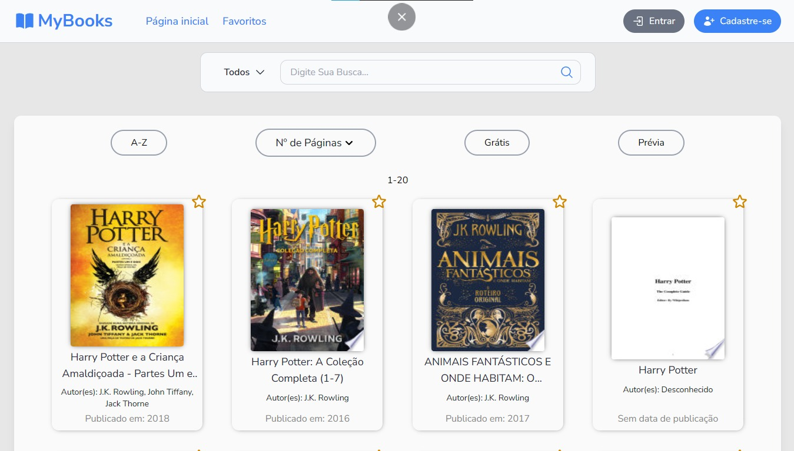

# MyBooks

> Projeto desenvolvido para o módulo intermediário do **Projeto Capacita Brasil**

  

<strong>Seu catálogo de biblioteca disponível em qualquer lugar, a qualquer hora.</strong>

 
<h1 align="center">📖 Início</h1>

   <strong>Desktop / Smartphone</strong>

  

> MyBooks é o lugar perfeito para você que está à procura de novos livros! Possuindo um sistema de Login e Registro, uma página inicial com vários filtros para melhor pesquisa e com uma renderização de Cards juntamente com um sistema de favoritos implementado. Mas então, você encontrou aquele livro que estava procurando? No nosso site você pode favoritar ele para salvar e poder visualizar a hora que quiser.
## 📲 Visualização
- Acesse o nosso site: [Clique aqui para acessar o MyBooks](https://mybooks-ebon.vercel.app/)
## 🛠 Tecnologias utilizadas
- React (^19.1.0)
- TailwindCSS (^4.1.11)
- react-router-dom (^7.6.3)
- react-hook-form (^7.60.0)
- heroicons (^2.2.0)
## 🎎 Envolvidos
- [Paulo Henrique](https://github.com/PauloHenrrq)
- [Emanuel Felicio](https://github.com/emanuelfelicio)
- [Dennis Araujo](https://github.com/Dennissant)
